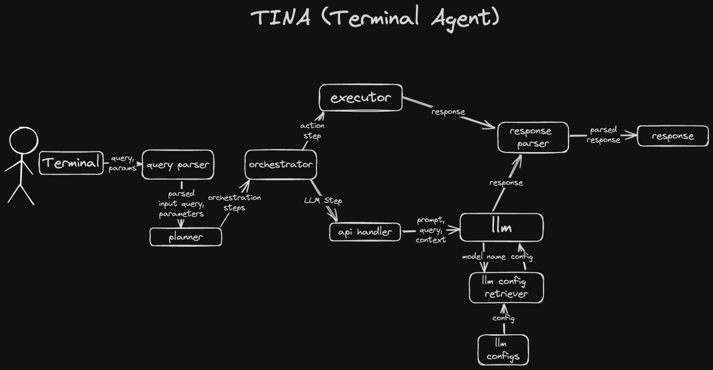

# tina
A local Terminal Agent leveraging the large language model Llama3.

## Design
Image of current design plan:

## Dev Roadmap
- [x] add user input from stdin
- [x] define an action for tina to carry out: display code in a single line
- [x] define an action for tina to carry out: search google
- [x] implement planner and clean up orchestration using claude suggestions
- [x] add logging
- [ ] add system for prompts
- [ ] multiturn?
- [ ] introduce a second, faster model for quicker iteration
- [ ] ...
